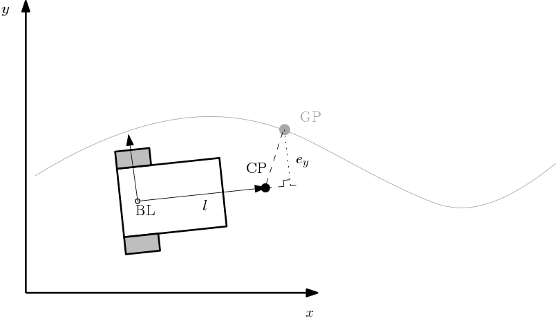
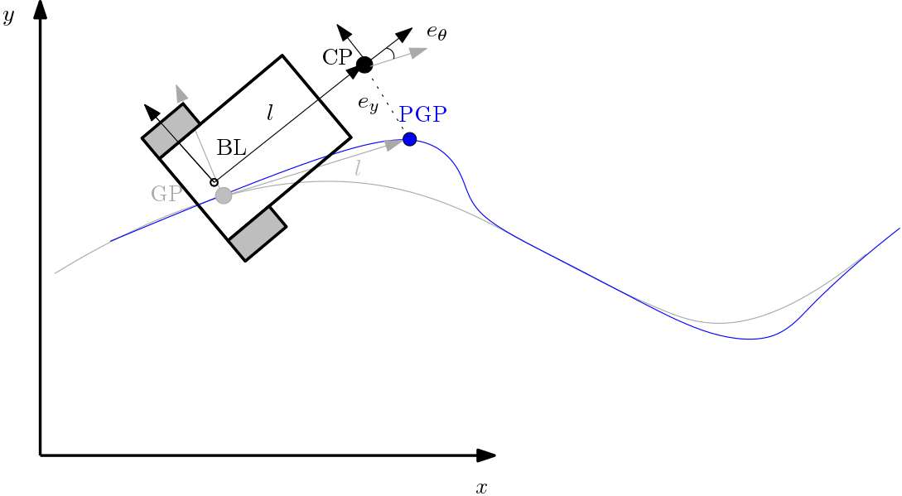
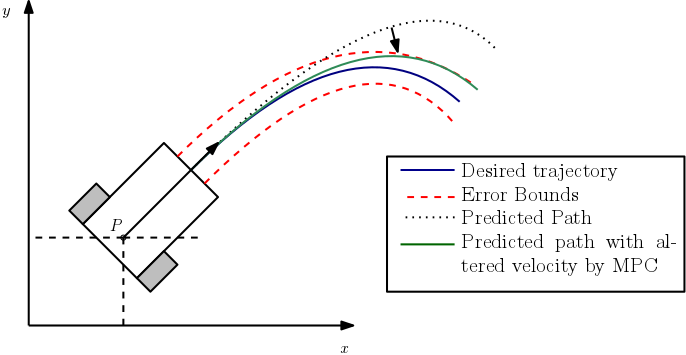
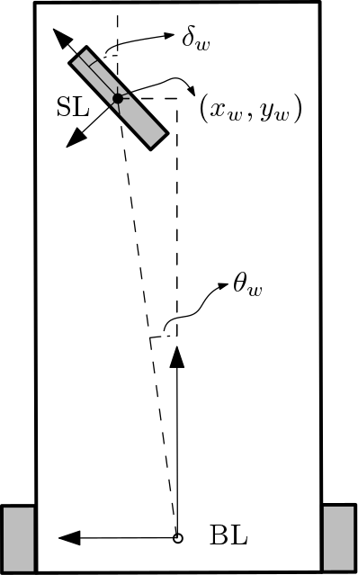
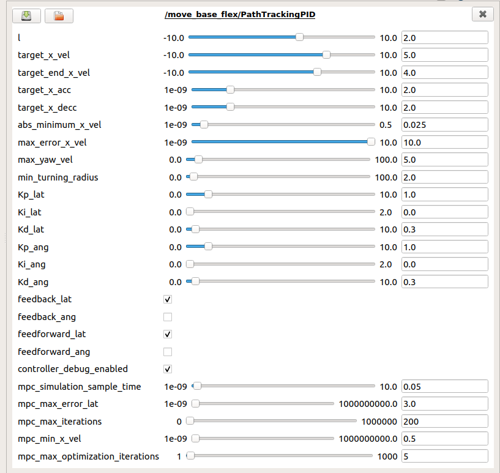

# path_tracking_pid

## Overview

Path Tracking PID offers a tuneable PID control loop decouling steerting and forward velocity. The forward velocity is generated in an open loop fashion by using target velocities and accelerations.

One of the tracking options uses a carrot of length l in front of the robot to determine the steering action based on the lateral error between the current Global Point (GP)  and the Control point (CP):

If a smooth path is provided, the controller has the option to track the path with the base_link directly instead of lagging behind a carrot. In this case a Projected Global Point (PGP) is computed as well which is tracked by the CP. In this mode, the yaw error can also be used as control input.

The PID contains two closed loops: Lateral and angular loops, and an open loop: Longitudinal. For non-holonomic robots, the lateral and angular loops can be combine to compute steering actions.

## Model Predictive Control

As an optional feature, we use a Model Predictive Control (MPC) concept to regulate the forward velocity. The user can specify a maximum desired error bound to track the path. Using the model of the robot plus the controller settings, a predicted path is calculated and if the error bound is violated, the forward velocity of the robot is decreased until the predicted path lies within acceptable bounds.

## Tricycle model

The tricycle model is supported as well.

It is assumed the front wheel is steered and driven. The steered wheel link (SL) can be asymmetrically placed with respect to the BL. Limitations of steering and actuation are also taken into account.
## Anti collision

When used as a plugin, Path Tracking PID uses the costmap (and the robot footprint from the costmap) for anti-collision. No evasive maneuvers will be preformed (sticking to the path is key). However when obstacles are detected in close proximity to the robot or in the direct line of direction of the robot, the forward velocity will be decreased. This results in safer velocities around obstacles. If an obstacle cannot be avoided or is too close to the robot, a standstill will occur and the navigation is cancelled.

The maximum velocity of the robot will be scale linear with the costmap values around or in path of the robot. One can use the inflation layers (or even social layers) to construct these gradients in the costmap.

**Keywords:** tracking, pid, local_planner, trajectory, model predictive control

### License

TBD

**Author:  Cesar Lopez, cesar.lopez@nobleo.nl.**

**Maintainer:  Cesar Lopez, cesar.lopez@nobleo.nl.**

**Affiliation: [Nobleo Projects](https://www.nobleo.nl)**

The path_tracking_pid package has been tested under [ROS] Melodic and Ubuntu 18.04.

## Installation

### Building from Source

#### Dependencies

- [Robot Operating System (ROS)](http://wiki.ros.org) (middleware for robotics),

#### Building

To build from source, clone the latest version from this repository into your catkin workspace and compile the package using

    cd catkin_workspace/src
    git clone https://bitbucket.org/nobleo/path_tracking_pid.git
    cd ../
    catkin_make

### Unit Tests

Run the unit tests with `catkin run_tests path_tracking_pid`

## Usage

The path_tracking_pid is a plugin for [move_base_flex](http://wiki.ros.org/move_base_flex).

To run move_base_flex with path_tracking_pid plugin:

    roslaunch path_tracking_pid path_tracking_pid_mbf.launch

## Static parameters

* **`base_link_frame`** (string, default: `base_link`) Name of the base link frame.

* **`holonomic_robot`** (bool, default: `false`) True for an holonomic robot. --> Unmaintained, expect bugs

* **`estimate_pose_angle`** (bool, default: `false`) Whether to take the pose angles from the path directly or to estimate them form consecutive path poses.

* **`use_tricycle_model`** (bool, default: `false`) True for using tricycle model instead of differential drive.

* **`steered_wheel_frame`** (string, default: `steer`) Name of the steered wheel frame.

* **`use_mpc`** (bool, default: `false`) True for using MPC to regulate x velocity.

## Configuring in RQT

Tracking_pid parameters are all available through (rqt_)dynamic_reconfigure. The main parameters are:

* **`l`** (double, default: `0.5`) Following distance from robot's rotational point to trajectory.
* **`track_base_link`** (bool, default: `false`) Whether to track the path using the base_link instead of the control point ahead. A smooth path is needed.
* **`init_vel_method`** (enum, default: `1`) Method to choose initial velocity on new paths.
* **`init_vel_max_diff`** (double, default: `0.5`) How much velocity difference is acceptable upon starting a new path. If internal state and current odometry's velocity differ more than this, the path will be aborted. Set to -1 to ignore this check. This check is only active if 'init_vel_method'==InternalSetpoint.

Proportional, Integral and Derivative actions for the two closed loops: Lateral and angular loops.

* **`Kp_lat`** (double, default: `1.0`) Proportional action gain for lateral loop.
* **`Ki_lat`** (double, default: `0.0`) Integral action gain for lateral loop.
* **`Kd_lat`** (double, default: `0.3`) Derivative action gain for lateral loop.
* **`Kp_ang`** (double, default: `1.0`) Proportional action gain for angular loop.
* **`Ki_ang`** (double, default: `0.0`) Integral action gain for angular loop.
* **`Kd_ang`** (double, default: `0.3`) Derivative action gain for angular loop.

Each loop can be enabled/disabled separetly.

* **`feedback_lat`** (boolean, default: `true`) Enable feedback lateral loop.
* **`feedback_ang`** (boolean, default: `false`) Enable feedback angular loop.

Moreover, feedforward using trajectory velocity can be enabled/disabled.

* **`feedforward_lat`** (boolean, default: `true`) Enable velocity feedforward for lateral loop.
* **`feedforward_ang`** (boolean, default: `false`) Enable velocity feedforward for angular loop.

Target velocities and accelerations for generating the open loop forward velocity:

* **`target_x_vel`** (double, default: `2.0`) Nominal target forward velocity.
* **`target_end_x_vel`** (double, default: `0.0`) Target forward velocity at the end of the path.
* **`target_x_acc`** (double, default: `2.0`) Desired acceleration at the beginning of the path.
* **`target_x_decc`** (double, default: `2.0`) Desired decceleration at the end of the path.

Constraints on the generated velocities:

* **`abs_minimum_x_vel`** (double, default: `0.025`) Minimum velocity of the vehicle, used to reach the very end of the path.
* **`max_error_x_vel`** (double, default: `1.0`) Maximum allowed x velocity error.
* **`max_yaw_vel`** (double, default: `2.0`) Maximum allowed yaw velocity
* **`max_yaw_acc`** (double, default: `2.0`) Maximum allowed yaw acceleration
* **`min_turning_radius`** (double, default: `0.0`) Minimum turning radius of the vehicle.

Constraints on the steered wheel for the tricycle model:

* **`max_steering_angle`** (double, default: `3.1416`) Maximum steering angle for tricycle model.

* **`max_steering_x_vel`** (double, default: `3.0`) Maximum steering x velocity for tricycle model.

* **`max_steering_x_acc`** (double, default: `2.0`) Maximum steering x acceleration for tricycle model.

* **`max_steering_yaw_vel`** (double, default: `0.5`) Maximum steering yaw velocity for tricycle model.

* **`max_steering_yaw_acc`** (double, default: `0.5`) Maximum steering yaw acceleration for tricycle model.

Anti-collision parameters:

* **`collision_look_ahead_length_offset`** (double, default: `1.0`) Offset in length to project rectangle collision along path.
* **`collision_look_ahead_resolution`** (double, default: `1.0`) Spatial resolution to project rectangle collision along path.

Debug topic enable:

 * **`controller_debug_enabled`** (boolean, default: `false`) Enable debug topic.

Parameters to configure MPC behavior:

* **`mpc_max_error_lat`** (double, default: `0.5`) MPC maximum allowed lateral error.
* **`mpc_min_x_vel`** (double, default: `0.5`) MPC minimum absolute forward velocity.
* **`mpc_simulation_sample_time`** (double, default: `0.05`) MPC simulation sample time MPC maximum allowed iterations forward in time.
* **`mpc_max_fwd_iterations`** (int, default: `200`) Prediction iterations. Total simulation time will be then mpc_max_fwd_iterations*mpc_simulation_sample_time.
* **`mpc_max_vel_optimization_iterations`** (int, default: `5`) MPC maximum allowed velocity optimization iterations.

## Launch files

* [launch/path_tracking_pid_mbf.launch](launch/path_tracking_pid_mbf.launch): Runs move_base_flex with path_tracking_pid plugin

* [test/test_path_tracking_pid.launch](test/test_path_tracking_pid.launch): If all is well, a red square moves along a toothed path that covers a square. The square should be followed by the base_link frame.

## Plugin
### path_tracking_pid/TrackingPidLocalPlanner
For use in move_base_flex. See launch/path_tracking_pid_mbf.launch to see an example.

#### Subscribed Topics

* **`path`** ([nav_msgs/Path])
    The path to follow.

* **`odom`** ([nav_msgs/Odometry])
    Robot odometry.

* **`/tf`** ([tf2_msgs/TFMessage])
    The position of the robot wrt. the frame in which the map is received.

* **`vel_max`** ([std_msgs/Float64])
    Dynamic maximum velocity. To be used for example when maximum power demands are reached.
    Higher level software could also use the reconfigure interface for this and set new speed values, but when required in a feedback-loop, this streaming topic is preferred.

#### Published Topics

* **`cmd_vel`** ([geometry_msgs/Twist])
    The Twist the robot should realize to track the desired path.

* **`feedback`** ([path_tracking_pid/PidFeedback])
    Estimated duration remaining and progress towards final goal.

* **`visualization_marker`** ([visualization_msgs/Marker])
    A Marker indicating the current control goal of the towards.

* **`collision_footprint_marker`** ([visualization_msgs/Marker])
    A Marker indicating the footprint(s) along the path that are used for ahead collision detection.

* **`debug`** ([path_tracking_pid/PidDebug])
    Intermediate values of the PID controller. Topic is silent by default, can be enabled via dynamic_reconfigure.

## Bugs & Feature Requests

Please report bugs and request features using the [Issue Tracker](https://bitbucket.org/nobleo/path_tracking_pid/).

[ROS]: http://www.ros.org
[rviz]: http://wiki.ros.org/rviz
